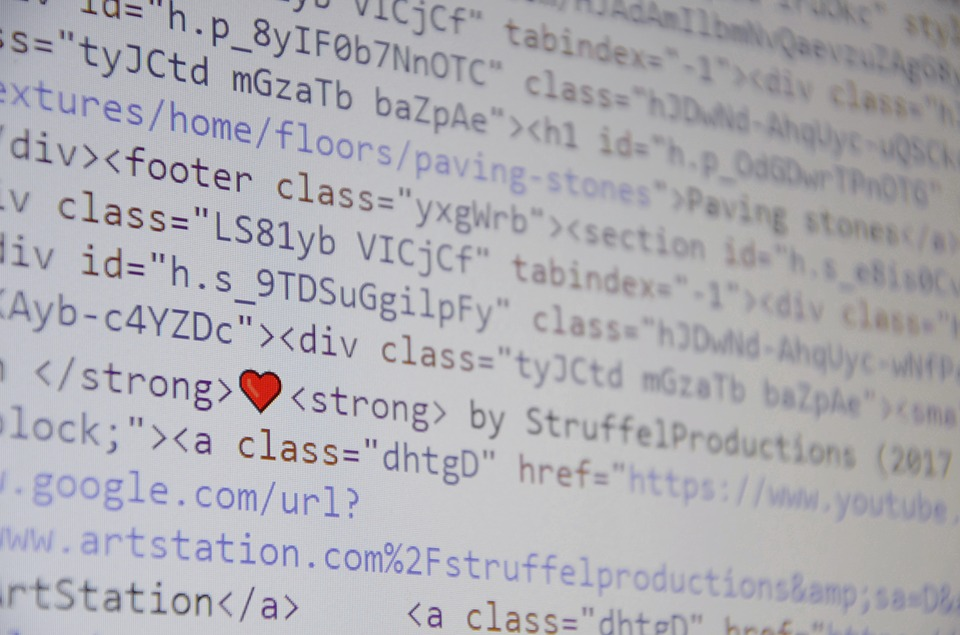

---
output:
  html_document: default
  pdf_document: default
---

# AI approach to Relationship crisis {#ai-relationship-crisis}

#### data driven approach to help people avoid, resolve, deal with relationships crisis, and predict, if can’t be fixed, help them move on with least disruption {-}

#### Keywords {-}

Relationship crisis, abuse in relationships, separation, divorce, data science in human emotion analysis, relationship coaching, inspirational articles, predictive model of relationship, privacy.

## increasing relationship crisis in digital age.

While divorce rate has been steadily dropping in the past couple of decades, the drop was mainly associated with a bigger drop in marriage rate.   However, less marriage does not mean there are less relationships, and lower divorce rate does not mean less break ups. [@bgsu_divorce_2016]

<!-- You can include images saved within your repo... -->
```{r breakdown,echo=FALSE,fig.cap='Relationship breakdown is 2nd most traumatic emotional expereince',fig.align='center',out.width='50%'}

```
Actually, it has been industry consensus that (romantic) relationship breakdown is only second to loss of family member (more on this later) in its emotional traumatic effect to the victim(s).  

So  divorce reduction while making the the number less alarming, is one example of using data to hide the actual human emotional suffering. 

There have been human therapists, coaches, not only they are limited in their experience relevant to the victim (previous cases they've seen/treated) but also the traumatic impact on the therapists themselves limit the amount of help they are able to offer everyday.  

What's more important is usually when people realize and make the effort to seek professional help, the problems are already too big to be ignored, which usually means much harder to fix by that time.

The availability of good and relevant guidance, insights is a long known challenge in this area, combined with privacy concerns, lead to most people going through this rely on their family, friends, if not themselves only. 


## A data science approach to human relationship.
The advancement of technology are commonly associated with undesirable shift in social interaction and structure, what often overlooked was the fact that ability to address such challenges are also presented with the technology advancement.
While AI and data science have the tendency of treating people more "like a denominator", it also gave us the ability to offer help in unprecedented ways. 

Take it technical, one of the most commonly cited problems of social interaction in digital age is that digital channel and contents replaced people's nature communication.   However, the opportunities associated with this "digital channel in between" was often looked upon as a drawback only, instead of being used for good - with more and more communication moving towards digital, we now have huge amount of data to process, lots of them might  not be relevant or meaningful when they were "novelties" however, as they become ubiquitous, we can now use these data to help people by analyzing the data pattern and its correlation, we would be able to predict relationship future that human therapists need months if not years of relationship with patients to do. 

<!-- ...or include images directly from the web. Cite your sources! -->

```{r machine-learning-help,echo=FALSE,fig.cap='[When data science come to the rescue of human love relationship]',fig.align='center',out.width='50%'}

```
While most news headlines are negative, like "smartphones are ruining your relationship", such statements are actually predictions of people's relationship future. We could have run much more serious data science study to support such notion, for example, would people who post, or consume more social media content during meal time (or late night) have high chances of changing their relationship status on social media?  Will two accounts that are shown as in a relationship checked in to the same place together, their usage pattern can be correlated to predict their relationship future as well. 
Because people voluntarily provide their relationship status, the change of such status could be used as target of prediction. 

We will focus on 2 of these possibilities: Relationship risk prediction, and AI therapist. 

There are some existing literature with time-series data for Facial Affect Coding, can predict divorce up to 90% of accuracy [@john_gottman_gottman_2015].  Considering how This approach can be combined with more innovative data processing that became newly available. For example, from analyzing couple's Facebook actions and interactions, we can determine people's personality with higher accuracy than traditional questionnaire  [@youyou_computer-based_2015].  Adding on top of that, personality can be used to predict romantic relationship [@noam_shpencer_how_2016].  Building on top of these ideas, we can leverage similar concept, using people's online behavior regarding relationship management, for example for a particular user, how many "divorce" related documents they have read .vs. how many "back together" advice they went through, how long they stay on different articles, NLP on their forum/chat stream for emotion analysis, and the type of service their inquiry, can be used to create a predictive model and used to predict "future of relationship".

The second area of innovation is AI therapist.  Back in 1964, one of the very first "chat-bot", ELIZA was built to be a non-directional psychotherapist (some say it's a parody).  The result was actually pretty astonishing, lots of people believed in the therapeutic power of ELIZA which pretty much just re-phrased any questions and ask it back at the user based on some pre-determined grammar rules.  While it was AI in its infancy, the more important revelation of ELIZA was human's reaction to AI, or as broader sense human's perception of intelligence including AI. 

As the AI technology advances, chat-bot is already at an unprecedented level. Considering the traditional Turing test requires the computer to fool 70% of the human judges that it can imitate human intellectual interrogation, we are within striking distance when it comes to specific field intelligent chat-bot that provides therapeutic values.  The AI therapist will be built on existing chat-bot platforms with special content of therapeutic session as training data.  In a sense of natural language processing and response generating form, it will be first used in education settings, for therapist training.  This provides a two way communication process where the AI therapist will offer examples of scenarios for human therapists in training, while human therapists will also catch and correct obvious errors that are generated in the AI chat-bot responses. 
The second phase would be a limited roll out, where free, or nearly free AI therapist will start to offer treatment sessions (or in new therapeutic model -- treatment stream, because AI does not have to time box helpful interactions because of money or hour limits) to light cases, and recommend more senior human therapist for severe cases.  As more users using it, more data will be collected, combining with our user behavior tracking and prediction model, we would be able to identify the effectiveness of the AI therapist (i.e. romantic status update, reading more positive articles instead of "divorce" topics, etc) 

## An analysis of our initial research
We have done some market research and focus group study.  We found that a lot of the studies in romantic relationship management are available, some of them even proposed certain "prediction" models.  However, most of these models require significant amount of human expert intervention, which makes large scale implementation cost-prohibitive.  Our plan is to leverage existing studies, and technologies, combine it with data science approach (ie. data collection from modern social media, news feeds, etc, and novel strategies, i.e. offering free gifts for people's anniversaries, or special dates - so that we get indirect information regarding their relationship).  We believe there are a lot of actual work can (and need to) be done in this area.  We hope everyone can leave a happier life.
